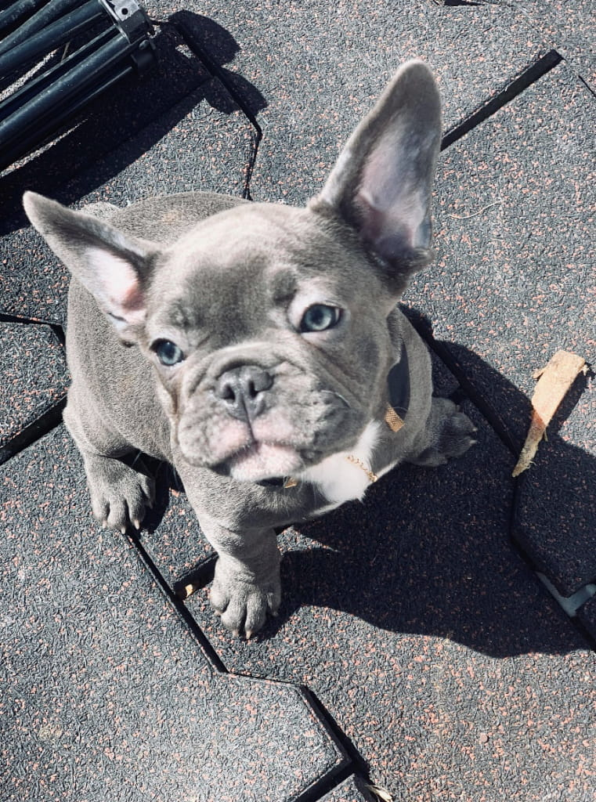
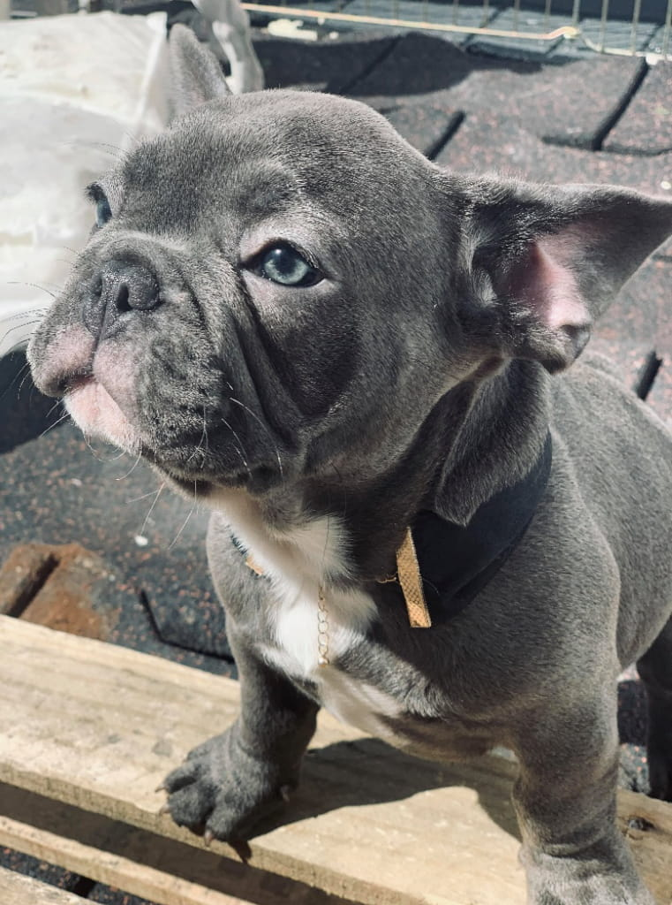

+++
fragment = "puppy"
weight = 101
#background = ""

title = "Ego"
#subtitle = ""
title_align = "left"

summary = """
My mom tells me I have the perfect structure and composition – I will grow up to be a perfect stud muffin. My blue eyes are just a bonus.
"""

[asset]
  image = "puppies/ego.jpg"
+++

### Personality

My name is Ego and I’m a solid blue French Bulldog puppy, currently residing in Manhattan, New York. I’m 11 weeks old but already pretty big and chunky boy. My mom tells me I have the perfect structure and composition – I will grow up to be a perfect stud muffin. My blue eyes are just a bonus. I’m just the easiest little man to get along with. I don’t complicate and I’m super satisfied with just chilling in your lap or chasing a ball across the floor.

We have a private roof and I love laying outside in the sun – in the typical Frenchie frog leg style. I love playing and am super good at destroying toys – so my current mom will recommend some durable toys that you can buy for me that will last more than 60 seconds.

I know there are plenty blue frenchies for adoption, but I will definitely spice things up in your household by being my clownish self, stealing your socks, sneakers and girlfriend – if you have one.

### Health

I’m as healthy as can be. My parents are health tested and panel 4 cleared. Additional health testing can be done on any pup if required by the new potential parent. But other than that I’m up to date on shots, dewormed multiple times, vet checked on many occasions, microchipped and ready to go. I know they say blue frenchies tend to be more sensitive and have more skin issues, but I come from healthy bloodlines that weren’t prone to any major health difficulties.

My temporary human parents focus on the well being and spoiling of us – blue frenchies, as well as finding us the perfect family that’s looking for French Bulldog Puppies for adoption NYC. Come meet me and let’s see if we are a match!

Also feel free to explore our blog on the best products you can use for French Bulldog care. We like everything organic produced from only natural ingredients that work wonders for the blue Frenchies and just generally for the bulldog breed. There are also grooming tips and tricks that might be useful for a new Frenchie owner.

If you are looking for French Bulldog Puppies for adoption NYC, please fill out the contact form and we will be with you in no time. Our blue frenchies are waiting for their forever homes now!

**Location**: NYC
