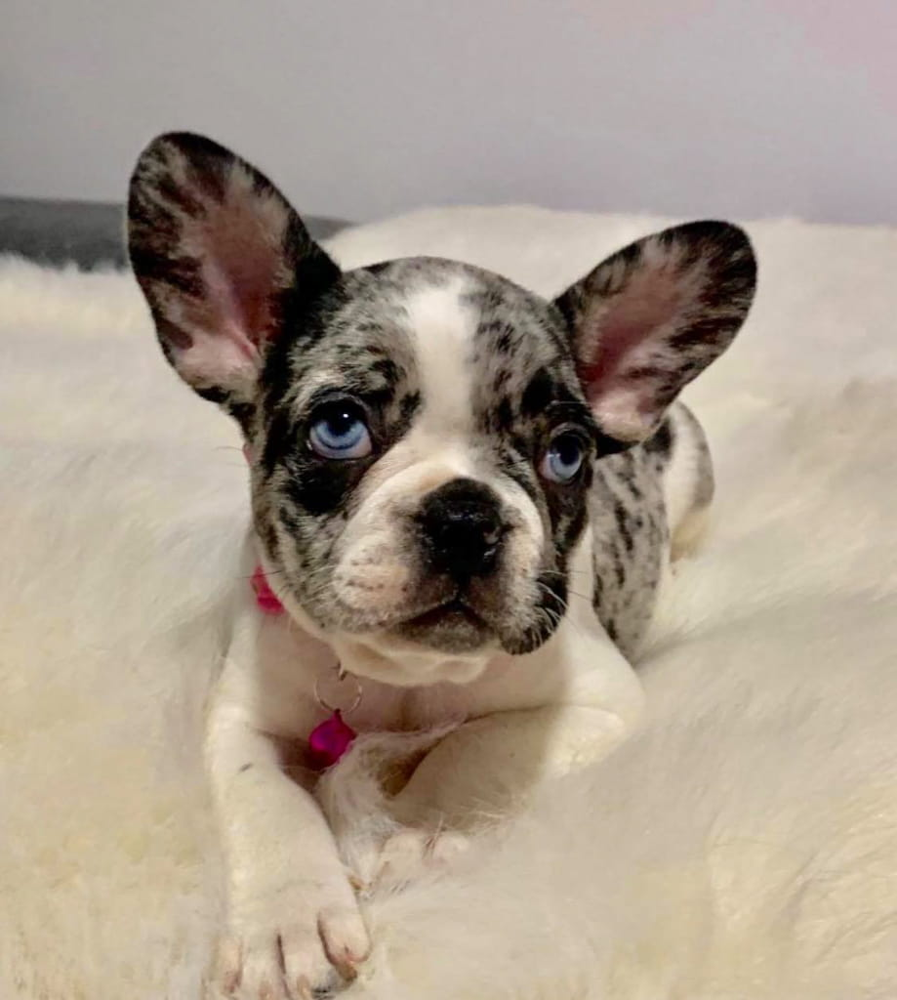
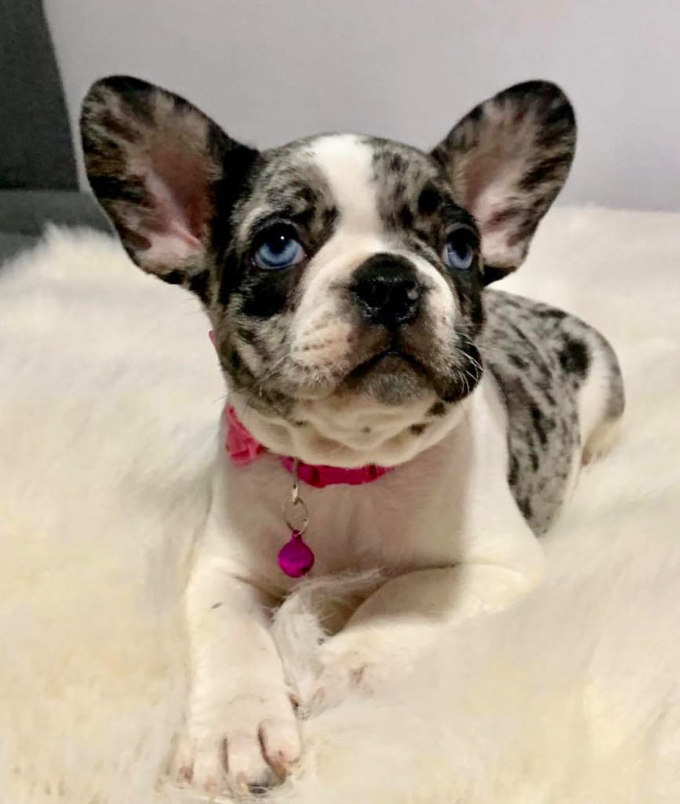
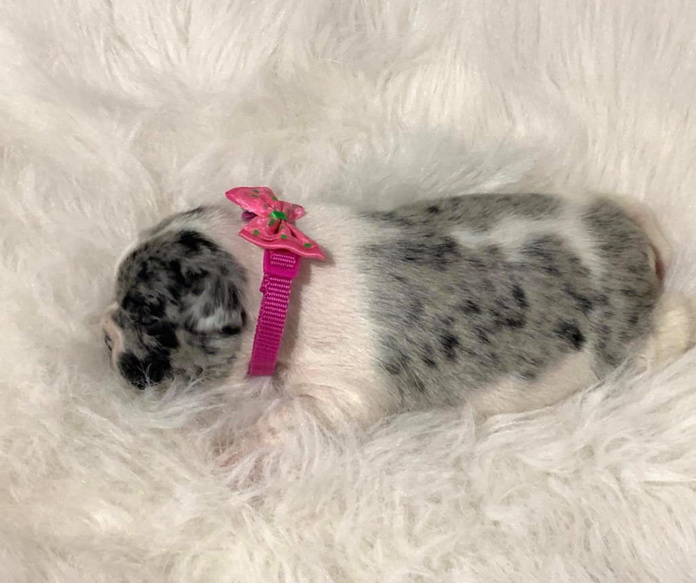

+++
fragment = "puppy"
weight = 102
#background = ""

title = "Electra"
#subtitle = ""
title_align = "left"

summary = """
I'm extremely sweet and easily adjustable to new situations and environments.
"""

[asset]
  image = "puppies/electra.jpg"
+++

Meet ELECTRA! She is one of our French Bulldog puppies for sale in NY. She’s a merle blue pied French Bulldog puppy with amazing blue eyes – standard for the merle. Electra definitely makes a statement with her appearance and her awesome temperament.

This litter only produced 3 puppies. Two girls and one boy who unfortunately didn’t make it. Our merle French Bulldog girls are almost ready to go to their forever homes, right after their next round of vaccines in the following week. We consider ourselves to be reputable French Bulldog breeders and provide best care for our puppies. We are talking about 24⁄7 contact care, temperature measuring, weighing, so losing a puppy is twice as devastating, when you know you did everything right.

### Personality

Electra could be described as the mellow French Bulldog Puppy sister compared to Sola. She is extremely sweet and easily adjustable to new situations and environments. She is the much smaller and submissive sister, but nonetheless just as special and adorable. Might be a bit shy while adjusting to her new home, so give her time and her personality will shine through. This Merle Frenchie puppy is great with kids and other animals.

### Health

If you researched the breed before deciding to buy a French Bulldog puppy, you know the breed in itself comes with some allergies and is very delicate indeed. Electra comes from healthy bloodlines and aren’t predisposed to any genetic conditions. Before leaving for their homes she will be up to date on their shots, dewormed on multiple occasions and free of any intestinal parasites, microchipped and pre-spoiled. They also come with a health guarantee. We consider ourselves as reputable French Bulldog breeders and focus on health and temperament of the puppies – ALWAYS.

If you are a first time French Bulldog puppy owner, feel free to check out our blog. It will offer some insight into where to go food and general care wise. Best organic products for the sensitive French Bulldog skin, grooming tools that might come in handy, shampoos that provide moisture and don’t irritate.

Food that won’t negatively affect digestion, cause flatulence or any other issues that Frenchies are prone to. All the food and grooming supplies we recommend are easy accessible for someone who is looking for French Bulldog puppies for sale NY. Your welcome. Almost every Pet Smart or PetCo carry all of the products. And then there is always Amazon at the end of the day. If you ever need food recommendations feel free to reach out at any time.

**Location**: NY