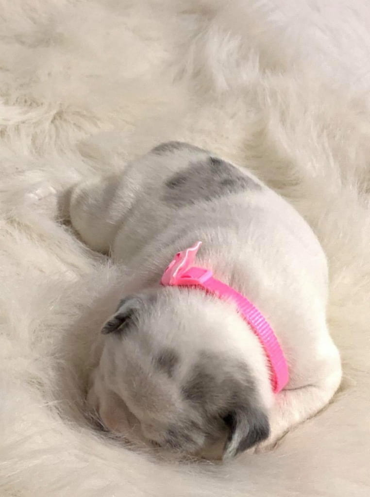
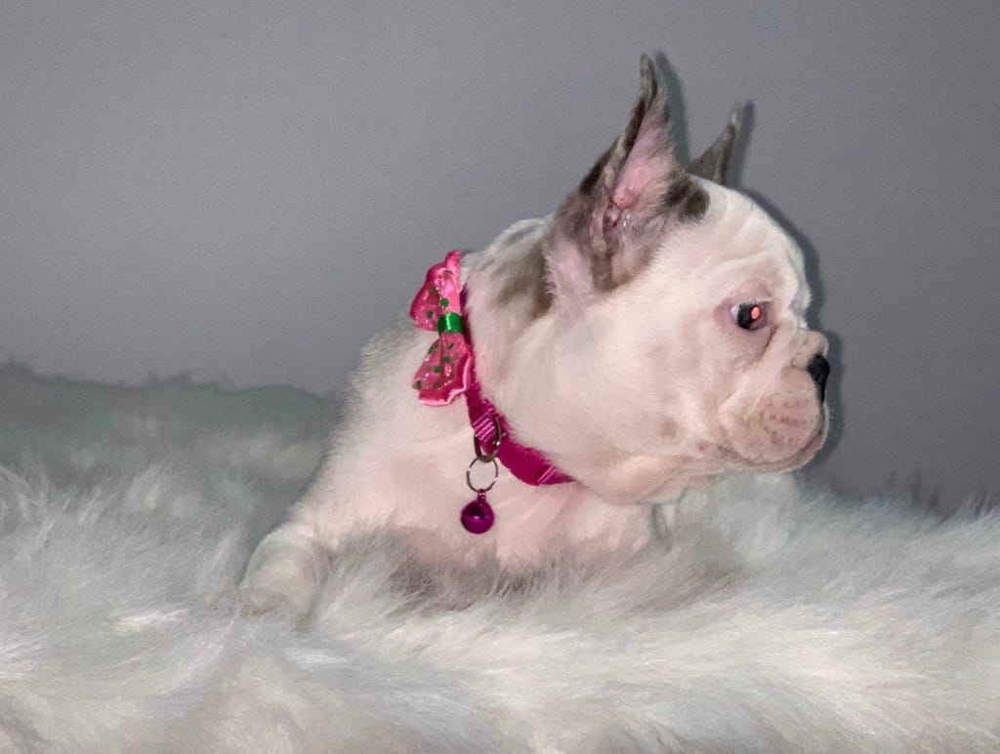
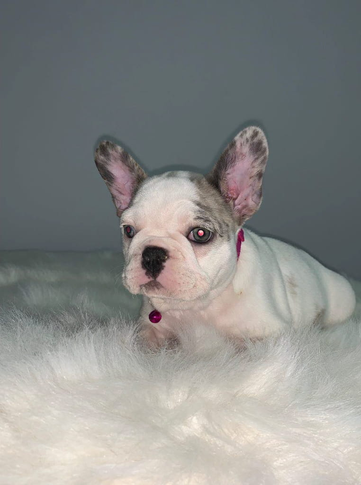
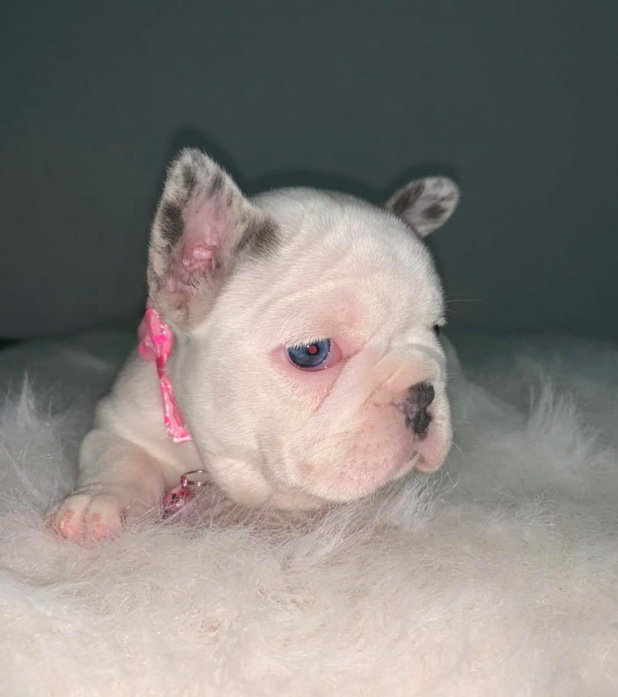

+++
fragment = "puppy"
weight = 103
#background = ""

title = "Sola"
#subtitle = ""
title_align = "left"

summary = """
I'm Sola, Electras big sister.
"""

[asset]
  image = "puppies/sola.jpg"
+++

Meet Sola. She’s Electras big sister. I think that everybody that met her so far, feels the same way that I do when I say, this French Bulldog puppy is extremely unique. Her structure is stocky and compact, she has the true French bulldog look, with some exotic touches. Her eyes are two different Blue colors, and look great in contract to her white coat. One of her eyes has an eyeliner look to it, which is beyond adorable. She is definitely one of a kind and very exceptional. SO if you are looking into French Bulldog puppies for adoption, you should come meet our special little girl.

### Personality

When looking for French Bulldog Puppies for adoption – it’s important to pick the right personality. Since birth this French Bulldog puppy was the more dominant sister, way bigger than Electra and always stepped all over her during feeding time. She likes to be the boss and have all eyes on her, however she is never dominant towards other animals or what you would consider an “alpha female” to be. If you are looking for a French bulldog puppy for sale, and would like to add a Frenchie puppy that is more exotic and one in a million, Sola might just be your perfect fit.

Our French Bulldog puppies are bread for health and temperament, always sweet to kids and get along with other dogs. She loves being carried around the city and meeting other French Bulldog puppies in New York City. Can’t go to the dog park yet, but when she’s ready she will rule the park for sure. We can’t believe she went from being a tiny little nugget – to the adorable little French Bulldog puppy she is today.

### Health

If you researched the breed before deciding to buy a French Bulldog puppy, you know the breed in itself comes with some allergies and is very delicate indeed. Sola comes from healthy bloodlines and aren’t predisposed to any genetic conditions. Before leaving for their homes she will be up to date on their shots, dewormed on multiple occasions and free of any intestinal parasites, microchipped and pre-spoiled. They also come with a health guarantee. Her mom is a solid blue, her dad a blue merle, both have little to no issues and are panel 4 clear.

If you are a first time French Bulldog owner, feel free to check out our blog. It will offer some insight into where to go food and general care wise. All the food and grooming supplies we recommend are easy accessible for someone who is looking for French bulldog puppies for adoption in New York.

### About French Bulldog Puppies for Sale in PA and Why Choosing and Reputable Breeder Matters

Even though most of our clients are located in either NYC or NC, we sometimes get contacted by people looking for French Bulldog puppies for sale in PA. And there is nothing wrong with that, it’s a short 2 hour drive to deliver a puppy to you. We are very flexible.

Most people are aware how important due diligence is when searching for French bulldog puppies for sale in PA. Online searching for French Bulldog puppies for sale in PA will often bring you to different listings that advertise French Bulldog puppies from puppy mills.

Puppy millers or backyard breeders will go above and beyond to convince you, you are getting a healthy puppy, but 90% of the time that is not the case. You might end up with a broken heart and a lot of vet bills.

Don’t get me wrong, there are good breeders in Pennsylvania, but make sure to do your research before committing to a puppy. Many people are impulse buyers, and won’t be able to say no when presented with a picture of a cute French Bulldog.

Ethical Frenchie will meet you half way or deliver a puppy to you if you are looking for French Bulldog puppies for sale in PA but have doubts regarding the breeders you spoke to and trouble committing to a new family member.

**Location**: PA